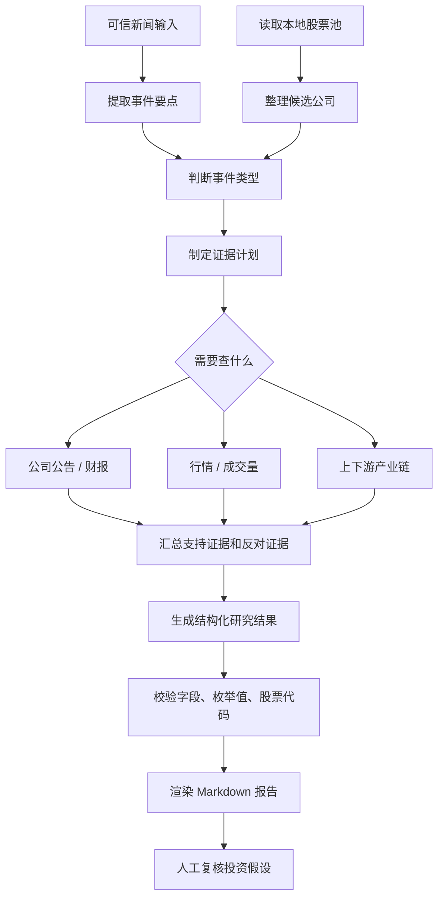

# Finance Research Lab 项目方案说明

更新时间：2026-07-09

## 1. 项目定位

`finance-research-lab` 是一个本地金融研究辅助工具。它当前要解决的不是自动荐股，也不是自动交易，而是把一条新闻整理成一份可复盘的研究报告：

- 这条新闻讲的是什么事件。
- 谁付钱，谁收钱，产业链怎么传导。
- 股票池里哪些标的可能相关。
- 哪些判断还需要验证。
- 最终输出一份 Markdown 报告，方便放进 Obsidian、GitHub 或自己的研究库。

一句话：当前项目的核心是“把新闻变成结构化研究卡片”。

后续新闻会接入可信新闻源，因此主流程不再把“验证新闻是真是假”作为重点。系统要验证的是另一件事：这条可信新闻是否真的会影响某些公司、影响路径是什么、财报和公告是否支持这个判断、市场价格和成交量是否已经反映。

## 2. 当前方案评价

当前方案能跑通最小闭环，但还不是一个成熟的研究 Agent 方案。

它的优点是：

- 流程简单，容易调试。
- LLM 输出有 schema 约束，不是直接相信自由文本。
- LLM 失败时有本地规则兜底，命令不会完全不可用。
- 每一步会记录执行状态，后续可以扩展成更完整的 Agent run。

它的问题也很明显：

- 研究深度主要依赖单次 LLM 判断和本地关键词规则。
- 没有行情、公告、财务、历史报告等证据源。
- 没有真正的多轮 Agent loop。
- 没有长期上下文，也没有 RAG。
- 当前报告更像“新闻拆解卡片”，还不像完整投资研究流程。

所以当前阶段更准确的定义是：

```text
MVP：结构化新闻研究报告生成器
```

不是：

```text
成熟版：可自主查证、多轮推理、证据闭环的投资研究 Agent
```

## 3. 输入和输出

### 输入

一条新闻链接：

```text
https://example.com/news/article
```

一个股票池 CSV：

```csv
symbol,name,market,themes,thesis,risks
300308.SZ,中际旭创,A股,AI;数据中心;光模块,AI光模块供应链,估值和拥挤交易
```

股票池字段含义：

| 字段 | 含义 |
| --- | --- |
| `symbol` | 股票代码 |
| `name` | 股票名称 |
| `market` | 市场，例如 A股 / 港股 / 美股 |
| `themes` | 主题标签，用英文分号 `;` 分隔 |
| `thesis` | 关注逻辑 |
| `risks` | 主要风险 |

### 输出

一份 Markdown 报告，包含：

- 原始新闻信息。
- 事件理解。
- 产业链路径。
- 股票影响映射。
- 当前阶段。
- 后续验证点。

默认输出到 `reports/` 目录。

## 4. 业务流程



这个流程的重点不是验证新闻本身，而是验证“新闻 -> 公司 -> 业绩 / 估值 / 市场行为”的推导链。

## 5. 代码分层

当前代码大致分成 9 层：

| 层 | 文件 | 职责 |
| --- | --- | --- |
| CLI 入口 | `src/finance_research_lab/cli.py` | 解析命令行参数，选择要跑哪条流程 |
| 工作流编排 | `src/finance_research_lab/workflow.py` | 决定先抓新闻、再读股票池、再分析、再写报告 |
| 工具封装 | `src/finance_research_lab/tools.py` | 把抓新闻、读股票池、分析、渲染、写文件包装成 tool result |
| LLM 研究分析 | `src/finance_research_lab/research_agent.py` | 构造研究报告 prompt，调用 LLM，解析 `ResearchReport` |
| LLM 任务规划 | `src/finance_research_lab/research_planner.py` | 构造验证任务 prompt，调用 LLM，解析 `ResearchTask` |
| LLM 客户端 | `src/finance_research_lab/llm/chat_completions_client.py` | 读取配置，发送 Chat Completions 请求 |
| 输出契约 | `src/finance_research_lab/research_report_schema.py` | 生成 JSON Schema，校验并解析 LLM 输出 |
| 本地兜底 | `src/finance_research_lab/news_trace.py` | LLM 失败时，用关键词规则生成研究结果 |
| 报告渲染 | `src/finance_research_lab/report.py` / `agent_report.py` | 把结构化结果渲染成 Markdown |

这个分层目前是合理的：业务流程、LLM 调用、schema 校验、本地规则和报告渲染没有混在一个文件里。

## 6. LLM 是怎么调用的

当前项目里有两类 LLM 调用。

### 6.1 生成研究报告

这是最核心的一次调用。

调用链：

```text
cli.py
  -> trace_news() / research_agent_cmd()

workflow.py
  -> run_news_trace_workflow()
  -> run_research_agent_workflow()

tools.py
  -> trace_news_tool()

research_agent.py
  -> analyze_research_report_with_agent()
  -> _build_messages()

llm/chat_completions_client.py
  -> ChatCompletionsClient.structured_completion()
  -> POST {LLM_BASE_URL}/chat/completions

research_report_schema.py
  -> research_report_json_schema()
  -> parse_research_report()
```

它实际做的事情是：

1. `research_agent.py` 把新闻和股票池整理成 prompt。
2. `research_report_schema.py` 生成 `ResearchReport` 的 JSON Schema。
3. `ChatCompletionsClient` 读取 `.env` 或环境变量里的 LLM 配置。
4. 客户端向 `{LLM_BASE_URL}/chat/completions` 发 POST 请求。
5. 模型返回 JSON 字符串。
6. `json.loads()` 把字符串转成 dict。
7. `parse_research_report()` 做严格校验。
8. 校验通过后返回 `ResearchReport`。
9. 校验失败或请求失败时，`tools.py` 会切到 `news_trace.py` 的本地规则 fallback。

### 6.2 生成研究任务

`research-agent` 命令还会多做一次任务规划。

调用链：

```text
workflow.py
  -> run_research_agent_workflow()

research_planner.py
  -> plan_research_tasks()
  -> analyze_research_tasks_with_agent()
  -> research_tasks_json_schema()

llm/chat_completions_client.py
  -> ChatCompletionsClient.structured_completion()
  -> POST {LLM_BASE_URL}/chat/completions
```

它的输出不是完整报告，而是一组后续验证任务，例如：

- 这类事件属于订单、业绩、政策、价格变化、资本开支还是风险暴露。
- 需要查哪些公司公告或财报字段。
- 需要查今天或本周的价格、涨跌幅、成交量、成交额。
- 新闻主题和股票池标的映射是否成立。
- 当前市场反应是否已经过热。

如果这次 LLM 调用失败，`research_planner.py` 会返回一组固定的 fallback 任务。

## 7. LLM 请求内容

LLM 请求由 `ChatCompletionsClient.structured_completion()` 统一发送。

请求体大致是：

```json
{
  "model": "gpt-4o-mini",
  "messages": [
    {
      "role": "system",
      "content": "你是投资研究结构化分析器..."
    },
    {
      "role": "user",
      "content": "{\"news\": {...}, \"watchlist\": [...]}"
    }
  ],
  "temperature": 0.2,
  "response_format": {
    "type": "json_schema",
    "json_schema": {
      "name": "research_report",
      "strict": true,
      "schema": {}
    }
  }
}
```

实际 schema 由 `research_report_json_schema()` 生成，里面要求模型必须返回这些顶层字段：

```text
raw_news
event
value_chain
stock_impacts
validation_tasks
stage
action_state
```

如果配置为：

```env
LLM_RESPONSE_FORMAT=json_object
```

客户端不会发送 OpenAI `json_schema` 格式，而是发送：

```json
{"type": "json_object"}
```

同时把 schema 文本追加到 system message 里。这是为了兼容只支持 JSON Output、不支持 strict JSON Schema 的服务。

## 8. LLM 配置

在项目根目录创建 `.env`：

```env
LLM_API_KEY=your_api_key_here
LLM_MODEL=gpt-4o-mini
LLM_BASE_URL=https://api.openai.com/v1
LLM_RESPONSE_FORMAT=json_schema
LLM_TIMEOUT_SECONDS=60
```

配置说明：

| 配置项 | 含义 | 默认值 |
| --- | --- | --- |
| `LLM_API_KEY` | 模型 API Key；不配置会走本地规则兜底 | 无 |
| `LLM_MODEL` | 使用的模型 | `gpt-4o-mini` |
| `LLM_BASE_URL` | OpenAI-compatible API 地址 | `https://api.openai.com/v1` |
| `LLM_RESPONSE_FORMAT` | 结构化输出模式：`json_schema` 或 `json_object` | `json_schema` |
| `LLM_TIMEOUT_SECONDS` | 请求超时时间 | `60` |

配置读取顺序：

```text
显式传入参数
-> 系统环境变量
-> .env 文件
-> 默认值
```

## 9. 后续数据源配置

下面这些配置是下一阶段要加的，不是当前代码已经实现的能力。

公司公告和财报工具配置：

```env
COMPANY_DATA_PROVIDER=akshare
COMPANY_DATA_API_KEY=your_company_data_key_here
COMPANY_DATA_BASE_URL=
COMPANY_DATA_TIMEOUT_SECONDS=30
TUSHARE_TOKEN=
```

行情和成交量工具配置：

```env
STOCK_DATA_PROVIDER=akshare
STOCK_DATA_API_KEY=
STOCK_DATA_BASE_URL=
STOCK_DATA_TIMEOUT_SECONDS=30
MARKET_LOOKBACK_DAYS=5
```

字段含义：

| 配置项 | 含义 |
| --- | --- |
| `COMPANY_DATA_PROVIDER` | 公司公告 / 财报数据源，例如 tushare、交易所公告接口或本地文件 |
| `COMPANY_DATA_API_KEY` | 公司数据源 key；AkShare 原型通常不需要，Tushare 需要 token |
| `COMPANY_DATA_BASE_URL` | 自建或第三方公司数据 API 地址 |
| `STOCK_DATA_PROVIDER` | 行情数据源，例如 akshare、tushare、yfinance |
| `STOCK_DATA_API_KEY` | 行情数据源 key；AkShare / yfinance 原型通常不需要，Tushare 需要 token |
| `STOCK_DATA_BASE_URL` | 自建或第三方行情 API 地址 |
| `MARKET_LOOKBACK_DAYS` | 默认查看最近几个交易日，先用 5 天代表“本周” |
| `TUSHARE_TOKEN` | 使用 Tushare provider 时需要 |

下一阶段建议先做 provider adapter，不要把某个数据源写死在业务 workflow 里。

目标工具：

```text
fetch_company_announcements(symbol, start_date, end_date)
  -> 公司公告列表

fetch_financial_reports(symbol, periods)
  -> 财报摘要、收入、利润、现金流、毛利率等核心字段

fetch_market_snapshot(symbol, lookback_days)
  -> 最近价格、涨跌幅、成交量、成交额、区间高低点
```

## 10. 三种使用方式

### 10.1 单条新闻研究

```powershell
finance-lab trace-news `
  --url "https://example.com/news/article" `
  --watchlist data/watchlist.example.csv `
  --output reports/demo-news-trace.md
```

适合快速把一条新闻拆成普通研究报告。

### 10.2 单条新闻 Agent 报告

```powershell
finance-lab research-agent `
  --url "https://example.com/news/article" `
  --watchlist data/watchlist.example.csv `
  --output reports/agent-report.md
```

适合生成更完整的报告：执行摘要、研究任务、证据列表和标准研究报告。

### 10.3 多条新闻机会雷达

```powershell
finance-lab radar `
  --urls "https://example.com/news/1" "https://example.com/news/2" `
  --watchlist data/watchlist.example.csv `
  --output reports/opportunity-radar.md
```

适合一天内收集多条新闻，做一个汇总雷达。

## 11. 当前流程里有没有循环

当前没有“模型自己决定下一步”的循环。

也就是说，现在还不是这种模式：

```text
AI 思考 -> 调工具 -> 看结果 -> 再思考 -> 再调工具 -> 最终输出
```

当前只有普通代码循环：

- `radar` 对多条新闻逐条分析。
- parser 对 `stock_impacts` 和 `validation_tasks` 逐项校验。
- 本地规则对 watchlist 逐个标的匹配主题。

这说明当前 Agent 还不够强，但也避免了过早引入不可控的多轮流程。

## 12. 当前上下文怎么处理

现在每次 LLM 调用只看本次输入：

- 当前新闻。
- 当前股票池。
- 当前输出格式要求。

当前还没有：

- 读取历史报告。
- 长期记忆。
- RAG 检索。
- 多轮工具调用。
- token 级上下文预算。

代码里已有 `src/finance_research_lab/agents/context.py`，但它还没有接入主流程。后续如果要做真正 Agent，应该把新闻摘要、工具结果摘要、历史报告摘要都统一放进这个上下文层。

## 13. 为什么当前方案还不够好

如果目标是“做一个像样的 AI 投资研究项目”，当前方案还缺三件关键能力：

### 13.1 证据闭环

现在模型能生成判断，但没有自动查证。

更好的方案应该能查：

- 公司公告。
- 财报。
- 行业数据。
- 行情和成交量。
- 历史研究记录。

然后报告里每个判断都要有证据来源，而不是只靠模型推断。

### 13.2 多轮研究流程

现在是一轮生成报告。

更好的方案应该是：

```text
可信新闻输入
-> 判断事件类型
-> 决定需要查什么证据
-> 调用公告 / 财报 / 行情 / 成交量工具
-> 整理支持证据和反对证据
-> 再判断公司影响和市场位置
-> 生成报告
```

这才是真正的 Agent loop。

### 13.3 更强的上下文管理

现在没有历史上下文。

更好的方案应该能回答：

- 这家公司之前有没有类似事件。
- 上一次报告怎么判断的。
- 这次新闻和历史假设是否一致。
- 哪些验证点已经完成，哪些还没完成。

这需要报告存储、检索和摘要，不只是 prompt 里塞更多文字。

## 14. 下一步建议

如果你觉得当前方案太简单，下一步不要直接做 UI，也不要先做回测，而是做“证据层 + 多轮研究流程”。

优先级建议：

1. 明确新闻源是可信输入
   后续新闻源接入后，系统不再把“找最早新闻来源”作为主验证任务。验证重点改为：公司影响是否成立、财报和公告是否支持、市场是否已经反映。

2. 新增公司公告和财报工具
   先定义 provider adapter 和返回结构，再接真实数据源。第一版只需要查公告标题、发布日期、公告类型、摘要，以及最近几期核心财务指标。

3. 新增行情和成交量工具
   支持查今天和最近 5 个交易日的价格、涨跌幅、成交量、成交额。先做快照，不要一开始就做复杂技术指标。

4. 做事件类型判断
   先把事件分成几类：订单 / 合同、业绩 / 指引、政策 / 监管、涨价 / 供需、资本开支、产品发布、风险暴露、纯情绪题材。

5. 做证据计划
   不同事件类型对应不同证据：订单看公告和客户；业绩看财报；涨价看供需和价格；资本开支看上下游；风险暴露看公告和市场反应。

6. 改报告结构
   把报告改成“结论 + 支持证据 + 反对证据 + 市场反应 + 待验证”。不要只写影响映射。

7. 最后再做真正 Agent loop
   当公告、财报、行情工具稳定后，再让模型按事件类型决定下一步该查什么。

更具体地说，下一步最值得做的是：

```text
把当前 ResearchReport 升级成 Evidence-first 多轮研究报告：
事件类型 -> 证据计划 -> 调工具 -> 整理证据 -> 判断影响 -> 输出报告。
```

这样项目会从“新闻摘要工具”往“研究系统”靠近。

关于“市场上发生的一类事件怎么分析”，先不要追求复杂模型。第一版就用一个朴素框架：

```text
事件是什么
-> 谁受益 / 谁受损
-> 上游是谁
-> 下游是谁
-> 哪些公司在股票池里
-> 公告和财报有没有支撑
-> 行情和成交量有没有异常反应
-> 现在是刚启动、验证中、过热，还是已经退潮
```

上下游分析不是全部，但它是现在最稳的第一步。后面再逐步加供需、价格、政策、财报和市场反应。
