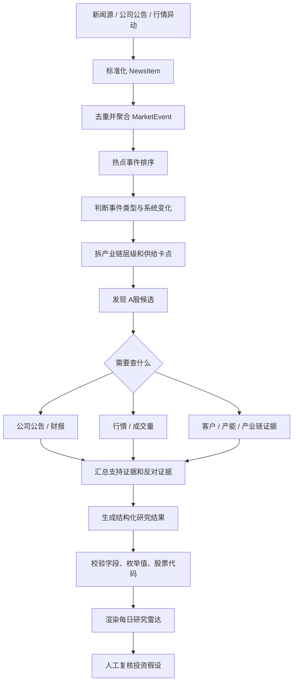

# Finance Research Lab 项目方案说明

更新时间：2026-07-10

## 1. 项目定位

`finance-research-lab` 是一个本地金融研究辅助工具。目标产品不是等待用户提交新闻 URL，而是主动发现近期热点和市场事件，把多个来源聚合成一个可研究事件，再生成可复盘的研究报告：

- 最近发生了哪些值得研究的事件。
- 哪些新闻、公告或行情异动属于同一个事件。
- 谁付钱，谁收钱，产业链怎么传导。
- 哪个产业链环节更难扩产或替代，哪些 A 股标的可能相关。
- 哪些判断还需要验证。
- 最终输出一份 Markdown 报告，方便放进 Obsidian、GitHub 或自己的研究库。

一句话：目标产品的核心是“主动发现事件，把热点变成有证据的产业链研究优先级”。

当前代码已经实现 URL 手动研究入口、BaoStock + AkShare 证据链和受控 Tool Calling。URL 路径继续用于手动深挖和调试，但不再代表产品最终入口。

后续新闻会接入可信新闻源，因此主流程不再把“验证新闻是真是假”作为重点。系统要验证的是另一件事：这条可信新闻是否真的会影响某些公司、影响路径是什么、财报和公告是否支持这个判断、市场价格和成交量是否已经反映。

## 2. 当前方案评价

当前 URL 驱动方案能跑通最小闭环，但还不是目标中的 Event-driven 研究 Agent。

它的优点是：

- 流程简单，容易调试。
- LLM 输出有 schema 约束，不是直接相信自由文本。
- LLM 失败时有本地规则兜底，命令不会完全不可用。
- 每一步会记录执行状态，后续可以扩展成更完整的 Agent run。

它的问题也很明显：

- 研究深度主要依赖单次 LLM 判断和本地关键词规则。
- 没有主动事件源、标准化、去重聚类和热点排序。
- 行情、公告和财务证据已经接入原型，但来源覆盖和稳定性仍有限。
- 已有受控 Tool Calling，但还没有“事件发现 → 卡点分析 → 候选发现”的完整循环。
- 没有长期上下文，也没有 RAG。
- 当前报告更像“新闻拆解卡片”，还不像完整投资研究流程。

所以当前阶段更准确的定义是：

```text
当前实现：URL 驱动的结构化研究报告生成器
```

不是：

```text
成熟版：可自主查证、多轮推理、证据闭环的投资研究 Agent
```

## 3. 输入和输出

### 目标输入

主入口不要求用户提交 URL，而是指定市场和时间窗口：

```text
market: A股
window: 最近 24 小时
event_sources: 可信新闻源 / 公司公告 / 行情异动
```

系统内部把每个来源标准化为 `NewsItem`，再聚合为 `MarketEvent`。URL 是 `NewsItem.source_url`，不是主输入。

### 当前辅助输入

一条新闻链接：

```text
https://example.com/news/article
```

一个股票池 CSV：

```csv
symbol,name,market,themes,thesis,risks
300308.SZ,中际旭创,A股,AI;数据中心;光模块,AI光模块供应链,估值和拥挤交易
```

股票池字段含义：

| 字段 | 含义 |
| --- | --- |
| `symbol` | 股票代码 |
| `name` | 股票名称 |
| `market` | 市场，例如 A股 / 港股 / 美股 |
| `themes` | 主题标签，用英文分号 `;` 分隔 |
| `thesis` | 关注逻辑 |
| `risks` | 主要风险 |

### 输出

一份 Markdown 报告，包含：

- 原始新闻信息。
- 事件理解。
- 产业链路径。
- 股票影响映射。
- 当前阶段。
- 后续验证点。

默认输出到 `reports/` 目录。

## 4. 业务流程



这个流程的重点不是验证单篇新闻本身，而是验证“多来源事件 -> 产业链卡点 -> 公司 -> 业绩 / 估值 / 市场行为”的推导链。

## 5. 代码分层

当前代码大致分成 9 层：

| 层 | 文件 | 职责 |
| --- | --- | --- |
| CLI 入口 | `src/finance_research_lab/cli.py` | 解析命令行参数，选择要跑哪条流程 |
| 工作流编排 | `src/finance_research_lab/workflow.py` | 决定先抓新闻、再读股票池、再分析、再写报告 |
| 工具封装 | `src/finance_research_lab/tools.py` | 把抓新闻、读股票池、分析、渲染、写文件包装成 tool result |
| LLM 研究分析 | `src/finance_research_lab/research_agent.py` | 构造研究报告 prompt，调用 LLM，解析 `ResearchReport` |
| LLM 任务规划 | `src/finance_research_lab/research_planner.py` | 构造验证任务 prompt，调用 LLM，解析 `ResearchTask` |
| LLM 客户端 | `src/finance_research_lab/llm/chat_completions_client.py` | 读取配置，发送 Chat Completions 请求 |
| 输出契约 | `src/finance_research_lab/research_report_schema.py` | 生成 JSON Schema，校验并解析 LLM 输出 |
| 本地兜底 | `src/finance_research_lab/news_trace.py` | LLM 失败时，用关键词规则生成研究结果 |
| 报告渲染 | `src/finance_research_lab/report.py` / `agent_report.py` | 把结构化结果渲染成 Markdown |

这个分层目前是合理的：业务流程、LLM 调用、schema 校验、本地规则和报告渲染没有混在一个文件里。

## 6. LLM 是怎么调用的

当前项目里有两类 LLM 调用。

### 6.1 生成研究报告

这是最核心的一次调用。

调用链：

```text
cli.py
  -> trace_news() / research_agent_cmd()

workflow.py
  -> run_news_trace_workflow()
  -> run_research_agent_workflow()

tools.py
  -> trace_news_tool()

research_agent.py
  -> analyze_research_report_with_agent()
  -> _build_messages()

llm/chat_completions_client.py
  -> ChatCompletionsClient.structured_completion()
  -> POST {LLM_BASE_URL}/chat/completions

research_report_schema.py
  -> research_report_json_schema()
  -> parse_research_report()
```

它实际做的事情是：

1. `research_agent.py` 把新闻和股票池整理成 prompt。
2. `research_report_schema.py` 生成 `ResearchReport` 的 JSON Schema。
3. `ChatCompletionsClient` 读取 `.env` 或环境变量里的 LLM 配置。
4. 客户端向 `{LLM_BASE_URL}/chat/completions` 发 POST 请求。
5. 模型返回 JSON 字符串。
6. `json.loads()` 把字符串转成 dict。
7. `parse_research_report()` 做严格校验。
8. 校验通过后返回 `ResearchReport`。
9. 校验失败或请求失败时，`tools.py` 会切到 `news_trace.py` 的本地规则 fallback。

### 6.2 生成研究任务

`research-agent` 命令还会多做一次任务规划。

调用链：

```text
workflow.py
  -> run_research_agent_workflow()

research_planner.py
  -> plan_research_tasks()
  -> analyze_research_tasks_with_agent()
  -> research_tasks_json_schema()

llm/chat_completions_client.py
  -> ChatCompletionsClient.structured_completion()
  -> POST {LLM_BASE_URL}/chat/completions
```

它的输出不是完整报告，而是一组后续验证任务，例如：

- 这类事件属于订单、业绩、政策、价格变化、资本开支还是风险暴露。
- 需要查哪些公司公告或财报字段。
- 需要查今天或本周的价格、涨跌幅、成交量、成交额。
- 新闻主题和股票池标的映射是否成立。
- 当前市场反应是否已经过热。

如果这次 LLM 调用失败，`research_planner.py` 会返回一组固定的 fallback 任务。

## 7. LLM 请求内容

LLM 请求由 `ChatCompletionsClient.structured_completion()` 统一发送。

请求体大致是：

```json
{
  "model": "gpt-4o-mini",
  "messages": [
    {
      "role": "system",
      "content": "你是投资研究结构化分析器..."
    },
    {
      "role": "user",
      "content": "{\"news\": {...}, \"watchlist\": [...]}"
    }
  ],
  "temperature": 0.2,
  "response_format": {
    "type": "json_schema",
    "json_schema": {
      "name": "research_report",
      "strict": true,
      "schema": {}
    }
  }
}
```

实际 schema 由 `research_report_json_schema()` 生成，里面要求模型必须返回这些顶层字段：

```text
raw_news
event
value_chain
stock_impacts
validation_tasks
stage
action_state
```

如果配置为：

```env
LLM_RESPONSE_FORMAT=json_object
```

客户端不会发送 OpenAI `json_schema` 格式，而是发送：

```json
{"type": "json_object"}
```

同时把 schema 文本追加到 system message 里。这是为了兼容只支持 JSON Output、不支持 strict JSON Schema 的服务。

## 8. LLM 配置

在项目根目录创建 `.env`：

```env
LLM_API_KEY=your_api_key_here
LLM_MODEL=gpt-4o-mini
LLM_BASE_URL=https://api.openai.com/v1
LLM_RESPONSE_FORMAT=json_schema
LLM_TIMEOUT_SECONDS=60
```

配置说明：

| 配置项 | 含义 | 默认值 |
| --- | --- | --- |
| `LLM_API_KEY` | 模型 API Key；不配置会走本地规则兜底 | 无 |
| `LLM_MODEL` | 使用的模型 | `gpt-4o-mini` |
| `LLM_BASE_URL` | OpenAI-compatible API 地址 | `https://api.openai.com/v1` |
| `LLM_RESPONSE_FORMAT` | 结构化输出模式：`json_schema` 或 `json_object` | `json_schema` |
| `LLM_TIMEOUT_SECONDS` | 请求超时时间 | `60` |

配置读取顺序：

```text
显式传入参数
-> 系统环境变量
-> .env 文件
-> 默认值
```

## 9. 后续数据源配置

当前 V1.5 使用 BaoStock 作为 A 股盘后日线行情主源，AkShare 继续负责公告、财报，并在
BaoStock 不可用、代码不支持或返回空数据时提供行情 fallback；两者都不需要 token。AkShare 证据
缓存默认位于 `data/akshare_cache/`，BaoStock 行情缓存默认位于 `data/baostock_cache/`。
行情缓存 TTL 为 24 小时；可用 `--refresh-evidence` 同时绕过两个行情缓存。

公司公告和财报工具配置：

```env
finance-lab sync-a-share-evidence --symbols 300308.SZ 600519.SH
```

行情和成交量工具配置：

```env
finance-lab research-agent --url "https://example.com/news" \
  --market-cache data/baostock_cache --refresh-evidence
```

字段含义：

| 配置项 | 含义 |
| --- | --- |
| `sync-a-share-evidence` | 手动刷新指定股票的公告、财报和行情缓存 |
| `--refresh-evidence` | 本次 Agent 报告强制刷新涉及候选的缓存 |
| `--market-cache` | BaoStock 行情缓存目录，默认 `data/baostock_cache/` |
| `data/akshare_cache/` | 不提交 Git 的本地 AkShare 公告、财报和 fallback 行情缓存 |
| `data/baostock_cache/` | 不提交 Git 的本地 BaoStock 行情缓存 |

行情 provider 顺序固定为 BaoStock → AkShare，不自动重试。两者都失败或字段缺失时，报告会保留
两个原始错误并将候选维持为 `unverified`，不会回退为 mock 数据。

`research-agent` 的证据层使用受控 Tool Calling。模型只能请求公司公告、财报或行情工具；每次调用的
股票代码必须来自本次 A 股候选，行情窗口限制在 1 到 20 个交易日，公告日期限制在过去 90 天。最多
执行三轮；同一 run 内相同工具和标准化参数只执行一次，重复 tool call 复用第一次结果。达到上限或
模型不再请求工具后，系统用全部工具结果生成严格的 `ResearchReport`。模型或
Function Calling 不可用时，系统回退到确定性证据计划，并在报告中标记 fallback 原因。模型没有调用
足够工具时，workflow 只补查缺失的公司和行情证据。候选必须同时具备非空公告或财报证据、有效行情
证据，才能标记为 `verified`；工具成功但返回空结果不算有效证据。

目标工具：

```text
fetch_company_announcements(symbol, start_date, end_date)
  -> 公司公告列表

fetch_financial_reports(symbol)
  -> 财报摘要、收入、利润、现金流、毛利率等核心字段

fetch_market_snapshot(symbol, lookback_days)
  -> 最近价格、涨跌幅、成交量、成交额、区间高低点
```

## 10. 三种使用方式

### 10.1 单条新闻研究

```powershell
finance-lab trace-news `
  --url "https://example.com/news/article" `
  --watchlist data/watchlist.example.csv `
  --output reports/demo-news-trace.md
```

适合快速把一条新闻拆成普通研究报告。

### 10.2 单条新闻 Agent 报告

```powershell
finance-lab research-agent `
  --url "https://example.com/news/article" `
  --watchlist data/watchlist.example.csv `
  --output reports/agent-report.md
```

适合生成更完整的报告：执行摘要、研究任务、证据列表和标准研究报告。

### 10.3 多条新闻机会雷达

```powershell
finance-lab radar `
  --urls "https://example.com/news/1" "https://example.com/news/2" `
  --watchlist data/watchlist.example.csv `
  --output reports/opportunity-radar.md
```

适合一天内收集多条新闻，做一个汇总雷达。

## 11. 当前流程里有没有循环

当前没有“模型自己决定下一步”的循环。

也就是说，现在还不是这种模式：

```text
AI 思考 -> 调工具 -> 看结果 -> 再思考 -> 再调工具 -> 最终输出
```

当前只有普通代码循环：

- `radar` 对多条新闻逐条分析。
- parser 对 `stock_impacts` 和 `validation_tasks` 逐项校验。
- 本地规则对 watchlist 逐个标的匹配主题。

这说明当前 Agent 还不够强，但也避免了过早引入不可控的多轮流程。

## 12. 当前上下文怎么处理

现在每次 LLM 调用只看本次输入：

- 当前新闻。
- 当前股票池。
- 当前输出格式要求。

当前还没有：

- 读取历史报告。
- 长期记忆。
- RAG 检索。
- 多轮工具调用。
- token 级上下文预算。

代码里已有 `src/finance_research_lab/agents/context.py`，但它还没有接入主流程。后续如果要做真正 Agent，应该把新闻摘要、工具结果摘要、历史报告摘要都统一放进这个上下文层。

## 13. 为什么当前方案还不够好

如果目标是“做一个像样的 AI 投资研究项目”，当前方案还缺三件关键能力：

### 13.1 证据闭环

现在模型能生成判断，但没有自动查证。

更好的方案应该能查：

- 公司公告。
- 财报。
- 行业数据。
- 行情和成交量。
- 历史研究记录。

然后报告里每个判断都要有证据来源，而不是只靠模型推断。

### 13.2 多轮研究流程

现在是一轮生成报告。

更好的方案应该是：

```text
可信新闻输入
-> 判断事件类型
-> 决定需要查什么证据
-> 调用公告 / 财报 / 行情 / 成交量工具
-> 整理支持证据和反对证据
-> 再判断公司影响和市场位置
-> 生成报告
```

这才是真正的 Agent loop。

### 13.3 更强的上下文管理

现在没有历史上下文。

更好的方案应该能回答：

- 这家公司之前有没有类似事件。
- 上一次报告怎么判断的。
- 这次新闻和历史假设是否一致。
- 哪些验证点已经完成，哪些还没完成。

这需要报告存储、检索和摘要，不只是 prompt 里塞更多文字。

## 14. 下一步建议

证据层和受控 Tool Calling 已经完成原型。下一步不要继续扩展手工多 URL 输入，也不要先做 UI 或回测，而是实现“自动事件发现 + 每日研究雷达”。

优先级建议：

1. 定义 `NewsItem`、`MarketEvent` 和 `Theme`
   `NewsItem` 表示单个新闻、公告或异动来源；`MarketEvent` 表示多来源聚合后的独立事件；`Theme` 表示多个事件形成的持续方向。

2. 接入一个可信事件源
   第一版只拉取最近 24 小时内容。单个来源失败必须可见，但不能中断其他来源。

3. 实现标准化、去重和事件聚类
   同一事件的多个 URL 只分析一次，同时保留全部 `source_url`。

4. 实现热点排序
   第一版只使用来源数量、来源可信度、发布时间、公司公告命中和行情 / 成交量反应，不引入复杂模型。

5. 复用现有研究下游
   对 Top 5 事件继续调用现有 A 股 universe、公告、财报、行情和受控 Tool Calling。

6. 接入 Serenity 式卡点分析
   先排产业链层级和难扩产、难替代的环节，再排公司，并输出证据强度、反方理由和判断降级条件。

### 14.1 事件源实现方案

事件发现不等于让模型自由浏览网页。系统维护已审核的 `EventSource` registry，每个 adapter 负责抓取、
字段映射和源级错误，统一输出 `NewsItem`：

```python
class EventSource(Protocol):
    name: str

    def fetch(
        self,
        since: datetime,
        until: datetime,
    ) -> tuple[NewsItem, ...]: ...
```

#### 财经新闻

第一版实现 `AkShareThsNewsSource`，调用 `stock_info_global_ths()`，映射标题、内容、发布时间和链接。
接口只返回最近 20 条，必须每 5-10 分钟运行并写入本地事件缓存，才能拼出最近 24 小时窗口。
`stock_info_global_futu()` 作为网络失败 fallback；`stock_info_global_cls(symbol="全部")` 缺少稳定的
原文 URL 字段，只用于交叉确认，不作为唯一事件证据。

长期方案可接 Tushare `major_news`，它支持 `start_date` / `end_date` 和多家来源，但需要单独开通权限。

#### 公司公告

新增 `CninfoLatestAnnouncementSource` 拉取巨潮资讯最新公告列表，用类别和标题筛选日常经营、业绩预告、
风险提示、股权变动、并购和回购等事件。当前
`stock_zh_a_disclosure_report_cninfo(symbol, ...)` 必须传股票代码，因此继续负责热点候选验证，不用于
遍历全部 A 股。形成明确的两层结构：

```text
发现：巨潮最新公告列表
验证：AkShare 单股巨潮公告接口
```

#### 行情异动

原型使用 `stock_zh_a_spot()` 低频拉取新浪沪深京全市场快照，读取涨跌幅、成交量和成交额；文档提示
重复运行可能导致临时封 IP，因此只允许收盘后运行一次，或盘中至少间隔 30 分钟。东方财富
`stock_zh_a_spot_em()` 虽然提供量比和换手率，但不作为主源，避免重复当前代理断开问题。

正式方案优先使用 Tushare `daily(trade_date=...)` 单日全市场数据。无论使用哪个发现源，BaoStock 都只
验证 Top 候选的最近日线，不负责遍历全市场。第一版异动条件保持确定性：

```text
abs(pct_chg) >= 5%
或成交额进入全市场前 100
或当日成交量 / 过去 5 日平均成交量 >= 2
或同一主题至少 3 只股票同步异动
```

#### 政策与产业

直接接权威站点列表页，不通过财经媒体二次转述：

- [国务院政策文件库](https://sousuo.www.gov.cn/zcwjk/)
- [国家发改委文件库](https://www.ndrc.gov.cn/xxgk/wjk/index.html?tab=ghwb)
- [工信部政务公开](https://wap.miit.gov.cn/zwgk/index.html)
- [中国证监会](https://www.csrc.gov.cn/)

每个站点实现独立的 HTML / JSON adapter，每 30-60 分钟拉取一次，保留标题、发布时间、发布机构、
分类、详情 URL 和正文摘要。后续再增加交易所、产业协会和商品价格来源。

#### 第一批 provider registry

```python
EVENT_SOURCES = (
    AkShareThsNewsSource(),
    CninfoLatestAnnouncementSource(),
    # V2 后续：SinaMarketAnomalySource(),
    # V2 后续：MiitPolicySource(), NdrcPolicySource(),
)
```

调度器逐个执行 provider，保留每个来源的 `success` / `error` 状态。单个来源失败仍继续聚合其他有效
`NewsItem`；全部来源失败时返回失败状态，不生成空的 `daily-radar.md`。

更具体地说，下一步最值得做的是：

```text
把当前 URL 研究 workflow 升级成 Event-driven 每日研究雷达：
事件源 -> NewsItem -> MarketEvent -> 热点排序 -> 产业链卡点 -> 候选发现 -> 证据核验 -> 输出报告。
```

这样项目会从“新闻摘要工具”往“研究系统”靠近。

关于“市场上发生的一类事件怎么分析”，先不要追求复杂模型。第一版就用一个朴素框架：

```text
最近有哪些事件
-> 哪些来源属于同一事件
-> 谁受益 / 谁受损
-> 哪个环节更难扩产或替代
-> 上游是谁
-> 下游是谁
-> 哪些公司在股票池里
-> 公告和财报有没有支撑
-> 行情和成交量有没有异常反应
-> 现在是刚启动、验证中、过热，还是已经退潮
```

上下游分析不是全部，但它是现在最稳的第一步。后面再逐步加供需、价格、政策、财报和市场反应。
